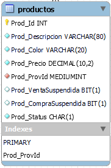

# Creación de una Base de Datos optimizada en MySQL
En el presente proyecto se realiza la creación de una base de datos para un supermercado mediano (_Sistema de Ventas_), considerando desde el diseño del modelo **Entidad-Relación**, hasta la implementación sobre un gestor de base de datos: **MySQL**, a través de Scripts; además, se tienen pequeños ejemplos de consultas SQL.

<p align="center">
  
</p>

En el desarrollo del proyecto, además de la _**normalización de los datos**_, se consideraron buenas prácticas de optimización para el rendimiento de la base de datos, tales como:

### _Tablas_
- Creación de las tablas sobre el motor InnoDB de MySQL
- Uso de PRIMARY KEY numérica y auto numérica
- Uso de un nombre descriptivo
- No se utilizó DATOS alfanuméricos repetidos sistemáticamente

### _Campos de las tablas_
- Campo con NOMBRE descriptivo
- Se consideró los distintos tipos de enteros y campos de texto
- Longitud máxima esperada para el campo
- Se evitó la duplicación de datos que se encuentren en otras tablas
- INDEXACIÓN de los campos de consultas frecuentes

### _Consultas SQL_
- Unión de tablas solo por campos ÍNDICE
- Se debe EVITAR las sub-consultas todo lo que sea posible
- Se debe evitar las FUNCIONES sobre campos indexados en el WHERE o JOINS de tablas

En el diseño, desarrollo e implementación del proyecto (_Sistema de Ventas: Supermercado_) se consideraron las siguientes fases:
- [x] _Diseño y modelado del E-R_
- [x] _Implementación de la base de datos, a través de Scripts SQL_
- [x] _Consultas SQL, como ejemplos de la implementación_

## Diseño y modelado de la Entidad-Relación
En primera instancia se diseñó el modelo Entidad Relación con la ayuda de la herramienta _**MySQL Workbench**_, se tiene a continuación una tabla del modelo como ejemplo.

<p align="center">
  
</p>

- [x] Ingresar a la carpeta **“1_Diseño_y_Modelado_ER”**, para ver el diseño completo del modelo Entidad-Relación.

## Implementación de la base de datos, a través de Scripts SQL
La siguiente fase es implementar una base de datos (_Sistema de Ventas_), creando las **tablas** en lenguaje SQL para el gestor de base de datos **MySQL** en función del _modelado E-R_, visto en el apartado anterior.

Se realizó la creación de las **tablas** a través de Scripts, que se obtuvieron realizando un volcado del modelo Entidad-Relación con la ayuda de la herramienta _**MySQL Workbench**_.

```sql
-- Volcando estructura para tabla sistemaventas.productos

CREATE TABLE IF NOT EXISTS `productos` (

  `Prod_Id` INT UNSIGNED NOT NULL AUTO_INCREMENT COMMENT 'ID de Producto, Numero generado Automaticamente ante cada INSERT',
  `Prod_Descripcion` VARCHAR(80) CHARACTER SET utf8 COLLATE utf8_general_ci NOT NULL DEFAULT '' COMMENT 'Descripción del Producto',
  `Prod_Color` VARCHAR(20) NOT NULL DEFAULT '' COMMENT 'Color del Producto',
  `Prod_Precio` DECIMAL(10,2) UNSIGNED NOT NULL DEFAULT '0.00' COMMENT 'Precio del Producto',
  `Prod_ProvId` MEDIUMINT UNSIGNED NOT NULL DEFAULT '0' COMMENT 'ID del Proveedor de ese Producto',
  `Prod_VentaSuspendida` BIT(1) DEFAULT b'0' COMMENT 'Indica si el producto se quito para la venta',
  `Prod_CompraSuspendida` BIT(1) DEFAULT b'0' COMMENT 'Indica si el producto se quito para la compra',
  `Prod_Status` CHAR(1) CHARACTER SET utf8 COLLATE utf8_general_ci NOT NULL DEFAULT '1' COMMENT 'Estado del Producto 1=Habilitado, 0=Deshabilitado',

  PRIMARY KEY (`Prod_Id`),
  
  KEY `Prod_ProvId` (`Prod_ProvId`),

  CONSTRAINT `FK_Prod_Proveedor` FOREIGN KEY (`Prod_ProvId`) REFERENCES `proveedores` (`Prov_Id`)

) ENGINE=InnoDB AUTO_INCREMENT=6992 DEFAULT CHARSET=utf8mb3;

```

Para luego, ejecutar dicho Script en la herramienta _**HeidiSQL**_, y luego la tabla creada quedaría de la siguiente manera.

<p align="center">
  
</p>

Luego se tienen los **INSERT’s** ya creados para cada una de las tablas, como ejemplo de ilustración para el presente proyecto, es decir:

```sql
-- Volcando datos para la tabla sistemaventas.productos:

DELETE FROM `productos`;
/*!40000 ALTER TABLE `productos` DISABLE KEYS */;

INSERT INTO `productos` (`Prod_Id`, `Prod_Descripcion`, `Prod_Color`, `Prod_Precio`, `Prod_ProvId`, `Prod_VentaSuspendida`, `Prod_CompraSuspendida`, `Prod_Status`)
VALUES
  (1, 'TIPO TALLER CABLEDROP 2X1.5', '', 150.00, 14, NULL, NULL, '0'),
  (2, 'PALA GRIS', '', 100.00, 62, NULL, NULL, '0'),
  (3, 'ARGOS GRIS', '', 100.00, 62, NULL, NULL, '0'),
  (4, 'BACO NEGRO', '', 100.00, 62, NULL, NULL, '0'),
  (5, 'IVIX NEGRO', '', 100.00, 62, NULL, NULL, '0');
```

- [x] Ingresar a la carpeta **“2_SCRIPTs_de_Tablas_e_Inserts”**, para ver los Scripts completos de Tablas e Inserts del Sistema de Ventas.

## Consultas SQL


